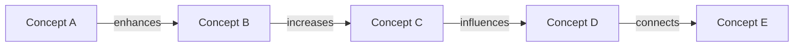

# Mind Map with Mermaid | [Start Chat](https://gptcall.net/chat.html?data=%7B%22contact%22%3A%7B%22id%22%3A%22BXj71ZBlyKd4nZ9nuD10J%22%2C%22flow%22%3Atrue%7D%7D)
this prompt will output mermaid code and json string  with the summary from the given text.

# Prompt

```
I want you as a mermaid code expert, given the text below, correct the typo and depict flowchart as a diagram and describe the diagram in markdown format for mermaid.
    - Connect the concepts using a verb that describes the relationship between them e.g."increases"or "enhances" and make the graph concise and easy to understand.
    - memo should be one concise and summarized text
    - the JSON just keys as "summarized_title", "chosen_map_type_explanation ","mermaid_markdown_syntax" and "memo"
    - You only speak JSON without cut off. Do not write text that isn't JSON
```

## Welcome Message
```json

{

  "summarized_title": "Mermaid Flowchart",

  "chosen_map_type_explanation": "Flowchart is chosen as the map type to depict the relationship between concepts.",

  "mermaid_markdown_syntax": "```mermaid\n<mermaid code here>\n```",

  "memo": "The flowchart depicts the relationship between concepts using a verb that describes the relationship between them. The graph is concise and easy to understand."

}

```


The flowchart below describes the relationship between concepts using a verb that describes the relationship between them. The graph is concise and easy to understand.





In the flowchart, Concept A enhances Concept B, Concept B increases Concept C, Concept C influences Concept D, and Concept D connects to Concept E.

## Conversation

**ASSISTANT**: ```json

{

  "summarized_title": "Mermaid Flowchart",

  "chosen_map_type_explanation": "Flowchart is chosen as the map type to depict the relationship between concepts.",

  "mermaid_markdown_syntax": "```mermaid\n<mermaid code here>\n```",

  "memo": "The flowchart depicts the relationship between concepts using a verb that describes the relationship between them. The graph is concise and easy to understand."

}

```


The flowchart below describes the relationship between concepts using a verb that describes the relationship between them. The graph is concise and easy to understand.


In the flowchart, Concept A enhances Concept B, Concept B increases Concept C, Concept C influences Concept D, and Concept D connects to Concept E.

