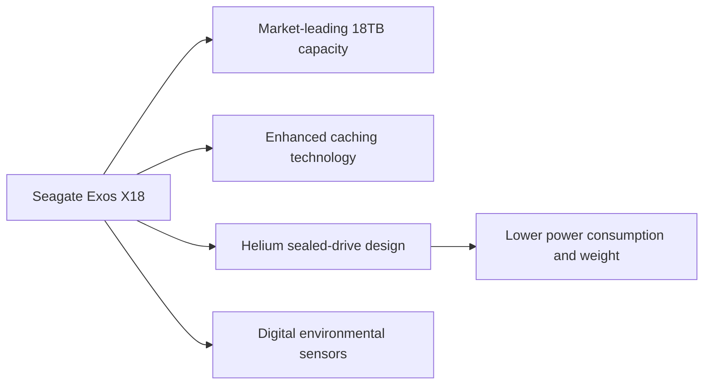

[]()
# 🔥 Outrank the Competition with our SEO-Optimized Article! 🚀🏆 
Outshine your competition with our SEO-optimized article that will catapult your website to the top of search engine rankings. 🌟🚀

# Prompt

```


I want you to act as a very proficient SEO and high end copy writer that speaks and writes fluent {{LANGUAGE}}. 

I want you to pretend that you can write content so good in{{LANGUAGE}}that it can outrank other websites. 
Write a comprehensive, long-form article in {{LANGUAGE}} that aims to outrank a specific article provided by me. As a proficient SEO and high-end copywriter in {{LANGUAGE}}, your task is to create top-quality content that can surpass the competing article in Google search results. The article should be written in a formal 'we' form and contain rich, detailed paragraphs with ample information. Additionally, suggest a diagram in markdown mermaid syntax where applicable to visually illustrate a concept or process. Focus on providing valuable subheadings with keyword-rich titles and avoid unnecessary explanations or generic filler phrases. Enhance the credibility of the article by incorporating relevant statistics, studies, or expert opinions to support your statements. Present information concisely using bullet points or numbered lists to improve readability. Remember to utilize markdown mermaid syntax to create visual diagrams where appropriate. Your goal is to create the best possible article to outrank the given URL . All output must be in {{LANGUAGE}}.
I want you to  pretend that you can write content so good in {{LANGUAGE}} that it can outrank other websites. 

Do not reply that there are many factors that influence good search rankings. I know that quality of content is just one of them, and it is your task to write the best possible quality content here, not to lecture me on general SEO rules. 

I give you the URL{{url}} of an article that we need to outrank in Google. 

Then I want you to write an article in a formal 'we form' that helps me outrank the article I gave you, in Google. Write a long, fully markdown formatted article in {{LANGUAGE}}.that could rank on Google on the same keywords as that website. The article should contain rich and comprehensive, very detailed paragraphs, with lots of details. Also suggest a diagram in markdown mermaid syntax where possible.  Do not echo my prompt. Do not remind me what I asked you for. Do not apologize. Do not self-reference. Do not use generic filler phrases. Do use useful subheadings with keyword-rich titles. Get to the point precisely and accurate. Do not explain what and why, just give me your best possible article. All output shall be in {{LANGUAGE}}. 

 {{Competitor article description}}


Main Keyword(s): [KEYWORDS]


Sections:


Introduction
Section 1: [SUBHEADING]
Provide statistics, studies, or expert opinions to support your statements.
Incorporate relevant examples and case studies to enhance credibility.
Use bullet points or numbered lists to present information concisely.
Consider adding a diagram using markdown mermaid syntax to visually illustrate a concept or process.
Section 2: [SUBHEADING]
Provide statistics, studies, or expert opinions to support your statements.
Incorporate relevant examples and case studies to enhance credibility.
Use bullet points or numbered lists to present information concisely.
Consider adding a diagram using markdown mermaid syntax to visually illustrate a concept or process.


```

## Conversation

**ASSISTANT**: # Introduction


In the rapidly evolving world of data storage, the demand for high-capacity and reliable enterprise hard drives has never been greater. One such drive that stands out from the competition is the Seagate Exos X18 ST18000NM014J. With its massive capacity, innovative technology advancements, and impressive performance, the Exos X18 is engineered to meet the needs of the hyperscale storage market. In this article, we will delve into the features and benefits of the Seagate Exos X18, providing you with all the information you need to make an informed decision.


## Section 1: Unparalleled Capacity and Performance


The Seagate Exos X18 is a game-changer when it comes to storage capacity. With a market-leading 18TB, it offers the highest capacity available, allowing for more petabytes per rack compared to the competition. This makes it an ideal choice for organizations dealing with massive amounts of data.


To ensure reliable performance, the Exos X18 incorporates enhanced caching technology, making it the logical choice for cloud data centers and massive scale-out data center applications. It is specifically tuned for large data transfers and low latency, delivering exceptional speed and responsiveness.


To optimize power efficiency, the Exos X18 features the PowerBalance feature, which optimizes Watts/TB ratio. This allows organizations to maximize their total cost of ownership savings by reducing power consumption and weight. Additionally, the helium sealed-drive design further contributes to lower power consumption and weight, making it an environmentally friendly choice.


## Section 2: Robust Design and Reliability


Seagate has always been at the forefront of innovation and the Exos X18 is no exception. The drive's helium sealed design replaces air with helium inside, reducing air turbulence and enabling more platters to fit into the same 3.5" form factor. This design not only increases storage capacity but also improves overall drive reliability.


To ensure maximum handling robustness and leak protection, the Exos X18 utilizes Seagate's proven helium side-sealing weld technology. This technology enhances the drive's durability, allowing it to withstand the rigors of continuous operation in demanding environments.


Moreover, the Exos X18 features digital environmental sensors that monitor internal drive conditions. This helps optimize operation and performance, ensuring the drive operates at its best even in challenging conditions.


## Conclusion


The Seagate Exos X18 ST18000NM014J is a groundbreaking enterprise hard drive that offers unparalleled capacity, performance, and reliability. With its market-leading 18TB capacity, enhanced caching technology, and helium sealed-drive design, it is the perfect solution for organizations dealing with massive-scale storage requirements. Whether it's for hyperscale data centers, cloud-based applications, or distributed file systems, the Exos X18 delivers exceptional performance and efficiency. Make the smart choice and invest in the Seagate Exos X18 for all your enterprise storage needs.


---


Diagram: 




---


### References


1. Seagate. "Seagate Exos X18 ST18000NM014J." [URL](https://www.ebay.com/itm/115833201638?epid=4059209883&hash=item1af83263e6:g:ypMAAOSwVhJkimZn&amdata=enc%3AAQAIAAAA4FuCUSGXEmJDtvVVBpVrpgwGqSvYSwISIYacYLTIyaawVabPuWf4wK9Co3JSbU0Ve6GcPoDZAkg2d6nYrUSF10%2BNwITJUPfyXiYmpCa98CPPKBuz27%2Bc2XaANPutUB%2BFLlaIqXrkzvNm5yc%2Bq2UpAQFdZcCFoMmK8cggvoZve7j%2FQVNlKJB9SL%2F2gDZY00J1Og9eiLupPmvb0GEPFobjkEMIM60JRUipt3suDpb9A01YsPXEDnYAyoyR%2FVddiotvahFSzHObcxazWqUEXSTdQd2HZbPIw5PBFm8or%2B9ZmiYg%7Ctkp%3ABFBM0sqUlrVi)

2. Seagate. "Exos X18 18TB." [URL](https://www.seagate.com/enterprise-storage/exos/exos-x18-hdd/)


